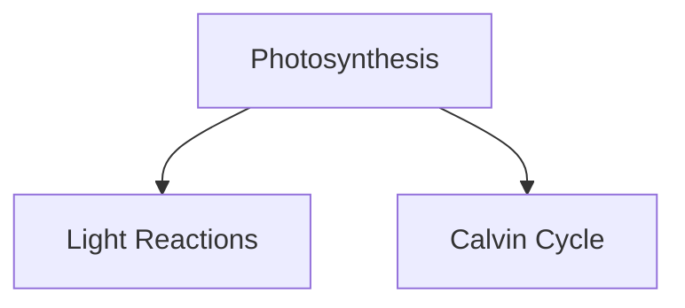

# AGENTS.md

This file provides guidance to coding agents when working with code in this repository.

---

## Quick Start

**Dev server:** `npm run dev` → http://localhost:3000
**Build:** `npm run build`
**Production server:** `npm start`
**Lint:** `npm lint`
**Setup:** After install, run `node scripts/download-face-api-models.js` to fetch ML models for emotion tracking.

---

## Project: VidyAI

AI-powered adaptive learning platform for students (grades 6–12). System tracks emotional state via webcam, adapts curriculum difficulty, provides AI tutoring, and gamifies progress.

### Core Value Proposition

- **Real-time emotion detection** → System suggests breaks if fatigued, simplifies explanations if confused
- **Adaptive curriculum** → Content difficulty adjusts based on focus/emotion
- **Private AI tutor** → Local face tracking (no data sent to servers); AI responses personalized by emotion state
- **School analytics** → Teachers see class focus metrics & engagement alerts (student privacy preserved)

---

## Tech Stack

| Layer                | Technology                                        |
| -------------------- | ------------------------------------------------- |
| **Framework**        | Next.js 16 (App Router)                           |
| **Language**         | TypeScript (strict mode)                          |
| **Styling**          | Tailwind CSS + Radix UI                           |
| **Animation**        | Framer Motion                                     |
| **Emotion Tracking** | face-api.js (browser-local, no backend)           |
| **AI Engine**        | Groq (tutor) + Google Gemini (content generation) |
| **Charts**           | Recharts                                          |
| **Forms/Validation** | React Hook Form + Zod                             |
| **State**            | React Context (hooks)                             |
| **PWA Support**      | Service workers + manifest.json                   |

---

## Installed Agent Skills

Helper guides installed in `.agents/skills/`. Use these when working on specific tasks. Think of them as "expert advisors" for different parts of the codebase.

### Making the App Faster (Performance)

| Agent                           | What It Does                                                     | Use When...                                    |
| ------------------------------- | ---------------------------------------------------------------- | ---------------------------------------------- |
| **vercel-react-best-practices** | Shows best ways to write fast React code                         | App feels slow, need to improve loading speed  |
| **core-web-vitals**             | Fixes page loading time, responsiveness, and visual stability    | Page takes too long to load or feels janky     |
| **tailwind-design-system**      | Helps organize colors, spacing, and design patterns consistently | Building new UI components or improving design |

### Making the App Work Better (Next.js & React)

| Agent                           | What It Does                                                   | Use When...                                        |
| ------------------------------- | -------------------------------------------------------------- | -------------------------------------------------- |
| **next-best-practices**         | Best practices for how to structure Next.js files and features | Building new pages or routes                       |
| **next-cache-components**       | Shows how to reuse data and avoid fetching it repeatedly       | App makes too many API calls or repeats work       |
| **vercel-composition-patterns** | Teaches how to build reusable, flexible components             | Refactoring messy components with too many options |
| **typescript-advanced-types**   | Makes code type-safe to catch bugs early                       | Finding type errors or building type-safe systems  |

### Making the App Accessible (for All Users)

| Agent                        | What It Does                                                | Use When...                                           |
| ---------------------------- | ----------------------------------------------------------- | ----------------------------------------------------- |
| **wcag-audit-patterns**      | Checks if the app works for people with disabilities        | Ensuring app works for screen readers, keyboard users |
| **accessibility-compliance** | Shows how to make forms, navigation, and content accessible | Building accessible buttons, forms, menus             |

### Building & Deploying

| Agent                     | What It Does                                         | Use When...                                  |
| ------------------------- | ---------------------------------------------------- | -------------------------------------------- |
| **api-design-principles** | Shows how to design good API endpoints               | Building `/api/groq` or `/api/gemini` routes |
| **github-actions-docs**   | Automates testing, building, and deploying your code | Setting up automated tests or deployments    |
| **deploy-to-vercel**      | Deploys the app to the internet (live server)        | Sharing app with others or going live        |

### Keeping Code Clean

| Agent                   | What It Does                                                    | Use When...                         |
| ----------------------- | --------------------------------------------------------------- | ----------------------------------- |
| **conventional-commit** | Standard way to write commit messages that everyone understands | Making clear, organized git history |

---

## Architecture

### Routes & Pages (app/)

| Path                                             | Purpose                                                                 |
| ------------------------------------------------ | ----------------------------------------------------------------------- |
| `/`                                              | Landing page — role selector (Student / School / Demo)                  |
| `/student-dashboard`                             | Core learning interface: emotion tracking, AI chat, flashcards, quizzes |
| `/admin-dashboard`                               | School portal: teacher analytics, student progress, fatigue alerts      |
| `/student-login`, `/school-login`, `/demo-login` | Auth gates                                                              |
| `/learning-brain`                                | Study brain/mind maps (AI-generated concept maps)                       |
| `/session-history`                               | Student session logs                                                    |
| `/api/groq`, `/api/gemini`                       | LLM proxy routes                                                        |
| `/api/match-mentor`                              | Recommend study partner/mentor                                          |

### Components by Domain

**Emotion & Motion Tracking** (`components/tracking/`, `components/motion/`)

- `face-emotion-detector.tsx` — Real-time facial expression analysis
- `motion-detector.tsx` — Eye gaze + head pose estimation
- `floating-emotion-tracker.tsx` — Overlay indicator of current emotion
- `webcam-access.tsx` — Permission prompt & video stream setup
- **Note:** face-api models are ~40MB; stored in `public/models/`. Download via script.

**Learning Core** (`components/learning/`)

- `ai-tutor-chat.tsx` — Main chat interface; sends emotion state to Groq
- `ai-quiz-generator.tsx`, `ai-flashcard-generator.tsx` — Call Gemini API to create content
- `mentor-matching.tsx` — Match students with peers
- `study-summaries.tsx` — AI-generated summaries + mermaid diagrams
- `mind-map.tsx` — Render concept trees
- `textbooks.tsx` — Mock content library

**Gamification** (`components/gamification/`)

- `achievement-badge.tsx`, `badge-collection.tsx` — Unlock badges
- `leaderboard.tsx` — XP rankings
- `daily-challenge.tsx` — Timed study tasks
- `reward-popup.tsx` — Confetti on wins
- `level-progress.tsx` — Progression tracking

**School Features** (`components/school/`)

- `student-management.tsx` — Admin view: student list, credentials
- `weekly-progress.tsx` — Class analytics: focus trends, fatigue alerts

**UI Primitives** (`components/ui/`)

- 50+ Radix + Tailwind wrapper components (button, card, dialog, etc.)
- All follow shadcn/ui patterns

### Services

**`services/gemini-api.ts`**

- `generateAiSummaryAndMindmap()` → Fetches `/api/gemini`; returns topic summary + mermaid tree
- `generateAiQuiz()`, `generateAiFlashcards()` → JSON array of questions/cards
- `getGeminiResponse()` → (Legacy) used before Groq switch; kept for fallback
- Helper utilities: `safeJsonParse()`, `repairTruncatedJson()` for robust LLM output handling

**`services/learning-style-service.ts`**

- Builds personalized system prompts based on student learning style (visual/auditory/kinesthetic)
- Injects emotion context (fatigue, attention level) to adapt AI responses

**`services/school-portal-service.ts`**

- Aggregates student analytics for teachers
- Privacy layer: class-level stats, not individual logs exposed

### Data & Config

- **`data/`** — Static assets: mock mentors, students, quiz banks
- **`public/models/`** — Pre-trained face-api.js weights (downloaded at setup)
- **`public/manifest.json`** — PWA config
- **`public/sw.js`** — Service worker for offline support
- **`components.json`** — UI component library metadata
- **`tailwind.config.ts`** — Color/spacing config
- **`.env.local`** — Required: `NEXT_PUBLIC_GEMINI_API_KEY` (read by `/api/gemini` route)

---

## Key Implementation Patterns

### 1. Emotion-Aware AI Responses

System prompt in `gemini-api.ts:getGeminiResponse()` includes:

- Current emotion state (confused → use analogies; tired → shorter response)
- Fatigue score (>60% → suggest break)
- Attention score (<40% → start with hook)
- Learning style (visual: more diagrams; auditory: explain verbally, etc.)

**Impact:** Same question gets different answers if student is confused vs. happy.

### 2. Privacy-First Tracking

- Face & motion detection run **entirely in browser** using face-api.js
- No video/frames sent to backend; only emotion scores are extracted
- face-api models (~40MB) are static weights bundled in `public/models/`
- Download must happen on first install: `node scripts/download-face-api-models.js`

### 3. LLM Proxy Routes

- `/api/groq` — Tutor responses (Groq 8B for speed)
- `/api/gemini` — Content generation (Gemini for quality)
- Both are **server-side** to hide API keys; client can't call LLMs directly

### 4. Component Naming

Multiple emotion/motion detector variants exist (simple, improved, accurate, reliable, demo).

- **Current production:** `real-time-emotion-detector.tsx`, `accurate-motion-detector.tsx`
- **Legacy variants:** experimental versions left in codebase; check routes to see which are active
- Clean up unused detector variants if consolidating

### 5. Mermaid Diagram Support

AI tutor can return markdown with mermaid blocks:



Rendered client-side by `study-summaries.tsx`.

---

## Environment & Setup

### Required Before Dev

1. **Node.js 20.x** — Check: `node -v`
2. **Install deps:** `npm install`
3. **Download ML models:** `node scripts/download-face-api-models.js`
   - Creates `public/models/tiny_face_detector_model-shard*.bin` (~10 files, 40MB total)
4. **API key:** Create `.env.local`:

   ```env
   NEXT_PUBLIC_GEMINI_API_KEY=your_actual_key_here
   ```

   - Needed for `/api/gemini` route (quiz/flashcard/summary generation)
   - Groq key (if using `/api/groq` for tutor) goes in server-side `.env` (not shown in README)

### Testing Without Webcam

- **Demo mode** has mock emotion data (no camera required)
- Click "Try Demo" on landing page
- Production emotion detection is **optional**; fallback gracefully if webcam denied

---

## Common Tasks

### Add a New Study Feature

1. Create component in `components/learning/new-feature.tsx`
2. Hook into `/student-dashboard/page.tsx` (main learning page)
3. If needs AI content: call `generateAiQuiz()` or similar from `services/gemini-api.ts`
4. If needs emotion context: pass `emotionState` prop through component tree

### Modify AI Tutor Behavior

Edit system prompt in `services/gemini-api.ts:getGeminiResponse()`. Examples:

- Change response length: Edit "SHORT: 3–5 sentences" rule
- Change tone: Add personality layer to system prompt
- Add subject-specific logic: Check `subject` param and branch behavior

### Add School Analytics

1. Aggregate student session data in `services/school-portal-service.ts`
2. Add chart to `/admin-dashboard/page.tsx`
3. Use Recharts to visualize
4. **Important:** Never expose individual student data; only class-level trends

### Fix Emotion Detection Issues

If face tracking fails or is unreliable:

1. Check `components/tracking/real-time-emotion-detector.tsx` — validate face-api models are present
2. Test with `/demo-login` to see mock vs. real detection
3. Add fallback emotion inference from motion (attention score) if face detection unavailable
4. Never block app; always have fallback tutor responses

---

## Testing & Deployment

### Local Testing

- **Dev build:** `npm run dev` (with HMR)
- **Production build locally:** `npm run build && npm start`
- **Linting:** `npm run lint` (checks TypeScript + ESLint)

### Deployment

- Hosted on **Vercel** (Next.js native)
- `.env.local` secrets → Vercel project settings (not in git)
- `public/models/` included in build; ~40MB per deployment
- Service worker auto-registered; offline support for session caching

### Known Limitations

1. **Large model files** — Consider CDN for face-api models if download slow
2. **Real-time tracking** — Emotion detection drops frames on low-end devices; add fps throttle if needed
3. **API quotas** — Groq/Gemini have rate limits; add caching for popular topics
4. **Privacy:** Session history stored in localStorage only; no persistent backend (yet)

---

## Git & Contribution

- **Branch naming:** `feature/`, `fix/`, `docs/` prefixes
- **Commits:** Conventional format: `type(scope): description` (e.g., `feat(tutor): add emotion branching`)
- **No enforced tests yet** — Add test suite if scaling

---

## Important Notes for Maintainers

1. **Emotion detection is experimental** — Face-api accuracy varies by lighting, angle, camera quality. Treat confidence scores cautiously.
2. **AI system prompts are load-bearing** — Tutor quality depends on system prompt engineering. Test prompt changes with real students.
3. **Privacy-first design** — Never send raw video/frames; only extract emotion scores. Maintain browser-local tracking.
4. **LLM costs** — Groq + Gemini calls add up. Monitor usage; consider caching summaries & quizzes by topic.
5. **Model updates rare** — face-api.js is mature but unmaintained; face detection may degrade on very new hardware/formats.

<!-- NEXT-AGENTS-MD-START -->[Next.js Docs Index]|root: ./.next-docs|STOP. What you remember about Next.js is WRONG for this project. Always search docs and read before any task.|If docs missing, run this command first: npx @next/codemod agents-md --output CLAUDE.md|01-app:{04-glossary.mdx}|01-app/01-getting-started:{01-installation.mdx,02-project-structure.mdx,03-layouts-and-pages.mdx,04-linking-and-navigating.mdx,05-server-and-client-components.mdx,06-fetching-data.mdx,07-mutating-data.mdx,08-caching.mdx,09-revalidating.mdx,10-error-handling.mdx,11-css.mdx,12-images.mdx,13-fonts.mdx,14-metadata-and-og-images.mdx,15-route-handlers.mdx,16-proxy.mdx,17-deploying.mdx,18-upgrading.mdx}|01-app/02-guides:{ai-agents.mdx,analytics.mdx,authentication.mdx,backend-for-frontend.mdx,caching-without-cache-components.mdx,cdn-caching.mdx,ci-build-caching.mdx,content-security-policy.mdx,css-in-js.mdx,custom-server.mdx,data-security.mdx,debugging.mdx,deploying-to-platforms.mdx,draft-mode.mdx,environment-variables.mdx,forms.mdx,how-revalidation-works.mdx,incremental-static-regeneration.mdx,instant-navigation.mdx,instrumentation.mdx,internationalization.mdx,json-ld.mdx,lazy-loading.mdx,local-development.mdx,mcp.mdx,mdx.mdx,memory-usage.mdx,migrating-to-cache-components.mdx,multi-tenant.mdx,multi-zones.mdx,open-telemetry.mdx,package-bundling.mdx,ppr-platform-guide.mdx,prefetching.mdx,preserving-ui-state.mdx,production-checklist.mdx,progressive-web-apps.mdx,public-static-pages.mdx,redirecting.mdx,rendering-philosophy.mdx,sass.mdx,scripts.mdx,self-hosting.mdx,single-page-applications.mdx,static-exports.mdx,streaming.mdx,tailwind-v3-css.mdx,third-party-libraries.mdx,videos.mdx,view-transitions.mdx}|01-app/02-guides/migrating:{app-router-migration.mdx,from-create-react-app.mdx,from-vite.mdx}|01-app/02-guides/testing:{cypress.mdx,jest.mdx,playwright.mdx,vitest.mdx}|01-app/02-guides/upgrading:{codemods.mdx,version-14.mdx,version-15.mdx,version-16.mdx}|01-app/03-api-reference:{07-edge.mdx,08-turbopack.mdx}|01-app/03-api-reference/01-directives:{use-cache-private.mdx,use-cache-remote.mdx,use-cache.mdx,use-client.mdx,use-server.mdx}|01-app/03-api-reference/02-components:{font.mdx,form.mdx,image.mdx,link.mdx,script.mdx}|01-app/03-api-reference/03-file-conventions/01-metadata:{app-icons.mdx,manifest.mdx,opengraph-image.mdx,robots.mdx,sitemap.mdx}|01-app/03-api-reference/03-file-conventions/02-route-segment-config:{dynamicParams.mdx,instant.mdx,maxDuration.mdx,preferredRegion.mdx,runtime.mdx}|01-app/03-api-reference/03-file-conventions:{default.mdx,dynamic-routes.mdx,error.mdx,forbidden.mdx,instrumentation-client.mdx,instrumentation.mdx,intercepting-routes.mdx,layout.mdx,loading.mdx,mdx-components.mdx,not-found.mdx,page.mdx,parallel-routes.mdx,proxy.mdx,public-folder.mdx,route-groups.mdx,route.mdx,src-folder.mdx,template.mdx,unauthorized.mdx}|01-app/03-api-reference/04-functions:{after.mdx,cacheLife.mdx,cacheTag.mdx,catchError.mdx,connection.mdx,cookies.mdx,draft-mode.mdx,fetch.mdx,forbidden.mdx,generate-image-metadata.mdx,generate-metadata.mdx,generate-sitemaps.mdx,generate-static-params.mdx,generate-viewport.mdx,headers.mdx,image-response.mdx,next-request.mdx,next-response.mdx,not-found.mdx,permanentRedirect.mdx,redirect.mdx,refresh.mdx,revalidatePath.mdx,revalidateTag.mdx,unauthorized.mdx,unstable_cache.mdx,unstable_noStore.mdx,unstable_rethrow.mdx,updateTag.mdx,use-link-status.mdx,use-params.mdx,use-pathname.mdx,use-report-web-vitals.mdx,use-router.mdx,use-search-params.mdx,use-selected-layout-segment.mdx,use-selected-layout-segments.mdx,userAgent.mdx}|01-app/03-api-reference/05-config/01-next-config-js:{adapterPath.mdx,allowedDevOrigins.mdx,appDir.mdx,assetPrefix.mdx,authInterrupts.mdx,basePath.mdx,cacheComponents.mdx,cacheHandlers.mdx,cacheLife.mdx,compress.mdx,crossOrigin.mdx,cssChunking.mdx,deploymentId.mdx,devIndicators.mdx,distDir.mdx,env.mdx,expireTime.mdx,exportPathMap.mdx,generateBuildId.mdx,generateEtags.mdx,headers.mdx,htmlLimitedBots.mdx,httpAgentOptions.mdx,images.mdx,incrementalCacheHandlerPath.mdx,inlineCss.mdx,logging.mdx,mdxRs.mdx,onDemandEntries.mdx,optimizePackageImports.mdx,output.mdx,pageExtensions.mdx,poweredByHeader.mdx,productionBrowserSourceMaps.mdx,proxyClientMaxBodySize.mdx,reactCompiler.mdx,reactMaxHeadersLength.mdx,reactStrictMode.mdx,redirects.mdx,rewrites.mdx,sassOptions.mdx,serverActions.mdx,serverComponentsHmrCache.mdx,serverExternalPackages.mdx,staleTimes.mdx,staticGeneration.mdx,taint.mdx,trailingSlash.mdx,transpilePackages.mdx,turbopack.mdx,turbopackFileSystemCache.mdx,turbopackIgnoreIssue.mdx,typedRoutes.mdx,typescript.mdx,urlImports.mdx,useLightningcss.mdx,viewTransition.mdx,webVitalsAttribution.mdx,webpack.mdx}|01-app/03-api-reference/05-config:{02-typescript.mdx,03-eslint.mdx}|01-app/03-api-reference/06-cli:{create-next-app.mdx,next.mdx}|01-app/03-api-reference/07-adapters:{01-configuration.mdx,02-creating-an-adapter.mdx,03-api-reference.mdx,04-testing-adapters.mdx,05-routing-with-next-routing.mdx,06-implementing-ppr-in-an-adapter.mdx,07-runtime-integration.mdx,08-invoking-entrypoints.mdx,09-output-types.mdx,10-routing-information.mdx,11-use-cases.mdx}|02-pages/01-getting-started:{01-installation.mdx,02-project-structure.mdx,04-images.mdx,05-fonts.mdx,06-css.mdx,11-deploying.mdx}|02-pages/02-guides:{analytics.mdx,authentication.mdx,babel.mdx,ci-build-caching.mdx,content-security-policy.mdx,css-in-js.mdx,custom-server.mdx,debugging.mdx,draft-mode.mdx,environment-variables.mdx,forms.mdx,incremental-static-regeneration.mdx,instrumentation.mdx,internationalization.mdx,lazy-loading.mdx,mdx.mdx,multi-zones.mdx,open-telemetry.mdx,package-bundling.mdx,post-css.mdx,preview-mode.mdx,production-checklist.mdx,redirecting.mdx,sass.mdx,scripts.mdx,self-hosting.mdx,static-exports.mdx,tailwind-v3-css.mdx,third-party-libraries.mdx}|02-pages/02-guides/migrating:{app-router-migration.mdx,from-create-react-app.mdx,from-vite.mdx}|02-pages/02-guides/testing:{cypress.mdx,jest.mdx,playwright.mdx,vitest.mdx}|02-pages/02-guides/upgrading:{codemods.mdx,version-10.mdx,version-11.mdx,version-12.mdx,version-13.mdx,version-14.mdx,version-9.mdx}|02-pages/03-building-your-application/01-routing:{01-pages-and-layouts.mdx,02-dynamic-routes.mdx,03-linking-and-navigating.mdx,05-custom-app.mdx,06-custom-document.mdx,07-api-routes.mdx,08-custom-error.mdx}|02-pages/03-building-your-application/02-rendering:{01-server-side-rendering.mdx,02-static-site-generation.mdx,04-automatic-static-optimization.mdx,05-client-side-rendering.mdx}|02-pages/03-building-your-application/03-data-fetching:{01-get-static-props.mdx,02-get-static-paths.mdx,03-forms-and-mutations.mdx,03-get-server-side-props.mdx,05-client-side.mdx}|02-pages/03-building-your-application/06-configuring:{12-error-handling.mdx}|02-pages/04-api-reference:{06-edge.mdx,08-turbopack.mdx}|02-pages/04-api-reference/01-components:{font.mdx,form.mdx,head.mdx,image-legacy.mdx,image.mdx,link.mdx,script.mdx}|02-pages/04-api-reference/02-file-conventions:{instrumentation.mdx,proxy.mdx,public-folder.mdx,src-folder.mdx}|02-pages/04-api-reference/03-functions:{get-initial-props.mdx,get-server-side-props.mdx,get-static-paths.mdx,get-static-props.mdx,next-request.mdx,next-response.mdx,use-params.mdx,use-report-web-vitals.mdx,use-router.mdx,use-search-params.mdx,userAgent.mdx}|02-pages/04-api-reference/04-config/01-next-config-js:{adapterPath.mdx,allowedDevOrigins.mdx,assetPrefix.mdx,basePath.mdx,bundlePagesRouterDependencies.mdx,compress.mdx,crossOrigin.mdx,deploymentId.mdx,devIndicators.mdx,distDir.mdx,env.mdx,exportPathMap.mdx,generateBuildId.mdx,generateEtags.mdx,headers.mdx,httpAgentOptions.mdx,images.mdx,logging.mdx,onDemandEntries.mdx,optimizePackageImports.mdx,output.mdx,pageExtensions.mdx,poweredByHeader.mdx,productionBrowserSourceMaps.mdx,proxyClientMaxBodySize.mdx,reactStrictMode.mdx,redirects.mdx,rewrites.mdx,serverExternalPackages.mdx,trailingSlash.mdx,transpilePackages.mdx,turbopack.mdx,typescript.mdx,urlImports.mdx,useLightningcss.mdx,webVitalsAttribution.mdx,webpack.mdx}|02-pages/04-api-reference/04-config:{01-typescript.mdx,02-eslint.mdx}|02-pages/04-api-reference/05-cli:{create-next-app.mdx,next.mdx}|02-pages/04-api-reference/06-adapters:{01-configuration.mdx,02-creating-an-adapter.mdx,03-api-reference.mdx,04-testing-adapters.mdx,05-routing-with-next-routing.mdx,06-implementing-ppr-in-an-adapter.mdx,07-runtime-integration.mdx,08-invoking-entrypoints.mdx,09-output-types.mdx,10-routing-information.mdx,11-use-cases.mdx}|03-architecture:{accessibility.mdx,fast-refresh.mdx,nextjs-compiler.mdx,supported-browsers.mdx}|04-community:{01-contribution-guide.mdx,02-rspack.mdx}<!-- NEXT-AGENTS-MD-END -->
